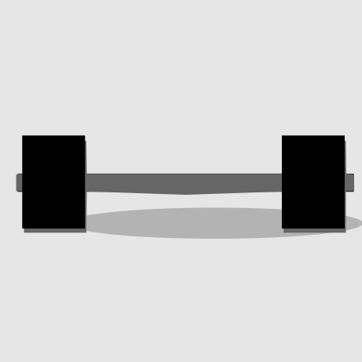
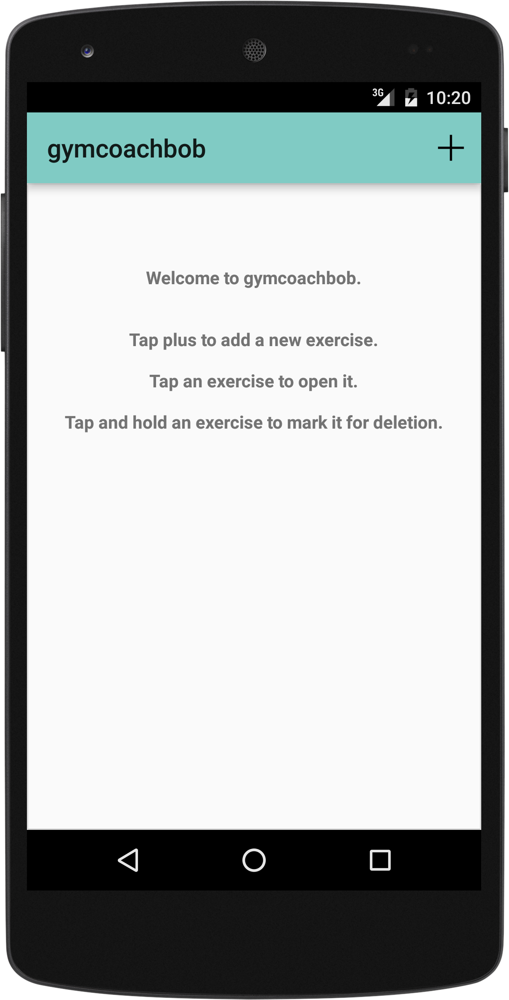
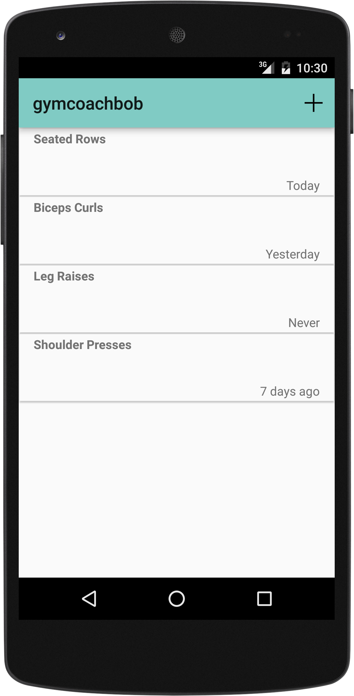
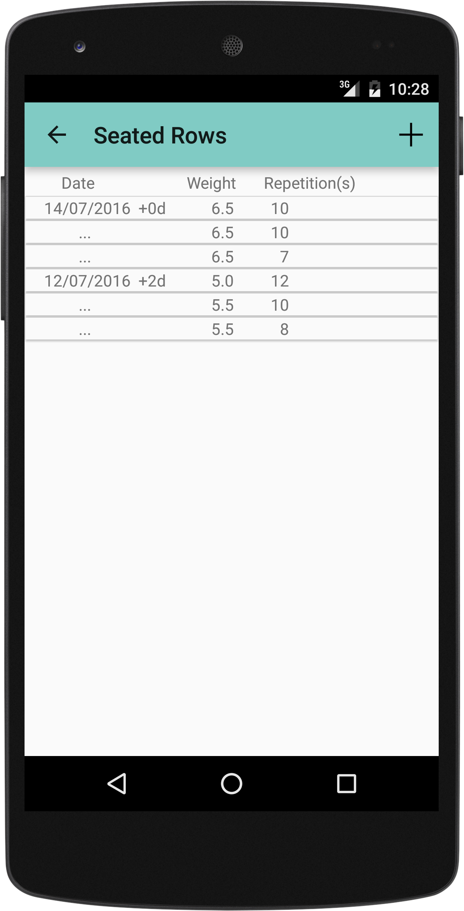
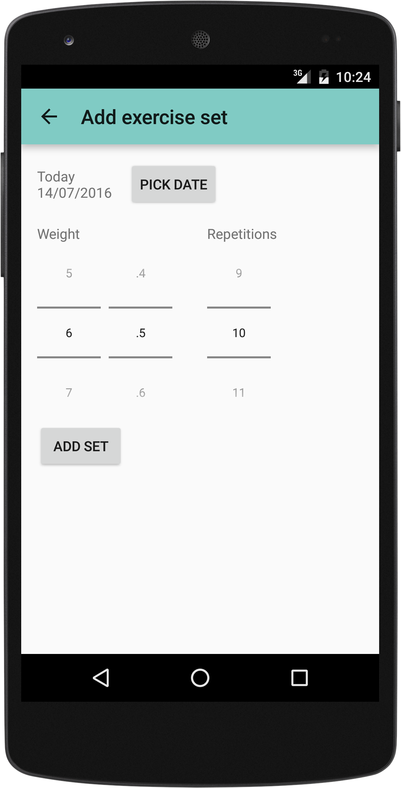

**gymcoachbob** helps you to keep track of all your exercises, and lets you log weight and repetitions for all the sets you do.

* ad-free, no unwanted popups or questionable tracking
* light-weight and easy on resources, works well on older devices
* intuitive, continue from your previously logged sets

Required permissions:

* access to external storage to store the logged exercises

## Screenshots

   

## Installing

Install from [Google Play](https://play.google.com/store/apps/details?id=com.baertiger_baer.gymcoachbob).

## Building

* clone the repository
* import project in Android Studio
* build project

## License

Licensed as per [LICENSE file](LICENSE).
